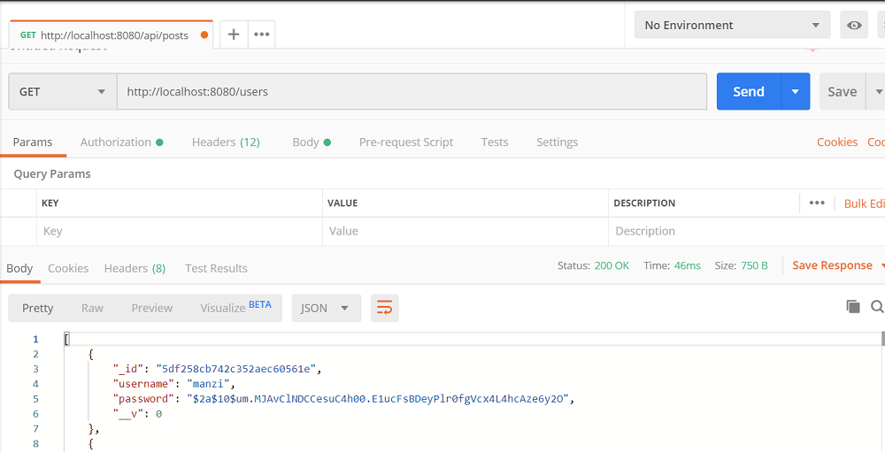
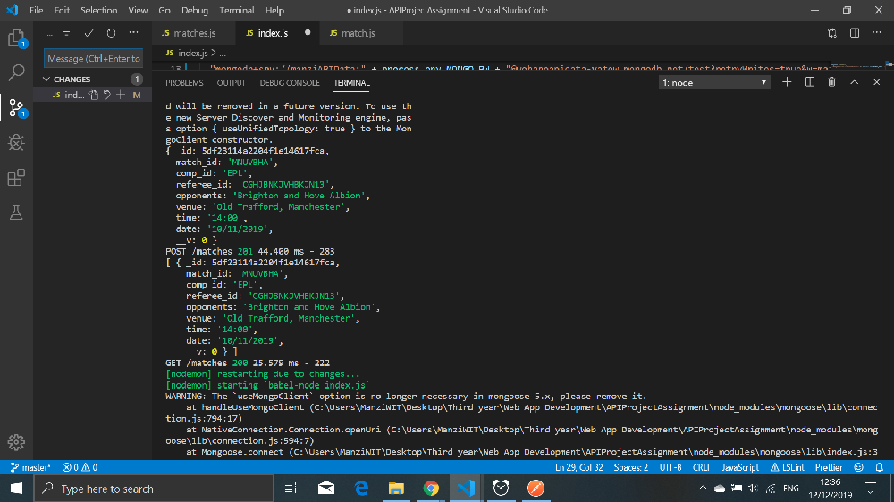
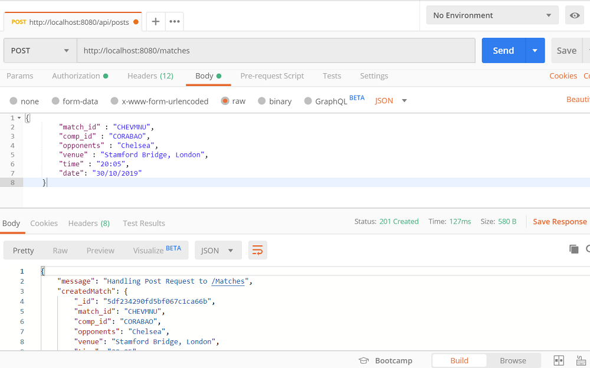

<<<<<<< HEAD
# ReactFAssignment

# BSc (Hons.) Level 8 - Assignment 1 - API

Name: Manzi Joseph

## Overview.
in this assignemnt i was meant to create an api that links my front end app that i created earlier but my front end app is a little bit incomplete hence i judt did the api on the other material and queryed data off mongo atlas using postman.i have all the crud working, ussing moongoose and i have three routes, matches,results,users .tried authenticating the user before they access the data but run into errors i couldnt fix same with the testing as well for the entire api. so decided i submit it 

## screenshoots

## Future
i sliped back on these assignments as i laid them off to try and sort my placement, but this module just tught me alot on how these app we use everyday work or just alittle bit of how they work and as a developer in my own time i will make it my goal to complete an app with a server and client/frontend and backend just for the fun and accomplishment as i havent managed to do it in this moment.
=======
# ReactAPI-Assignment
api
>>>>>>> f4de5c13a0cb9f498512c3fb43f1821e2dd08b7b
